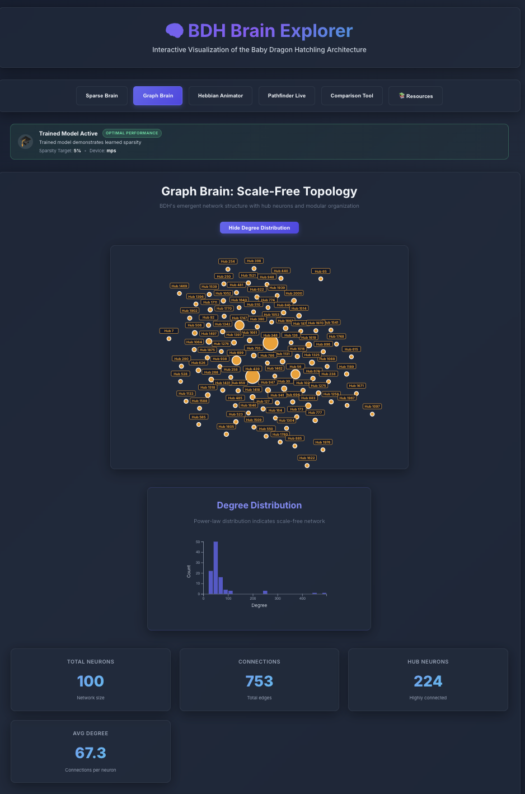
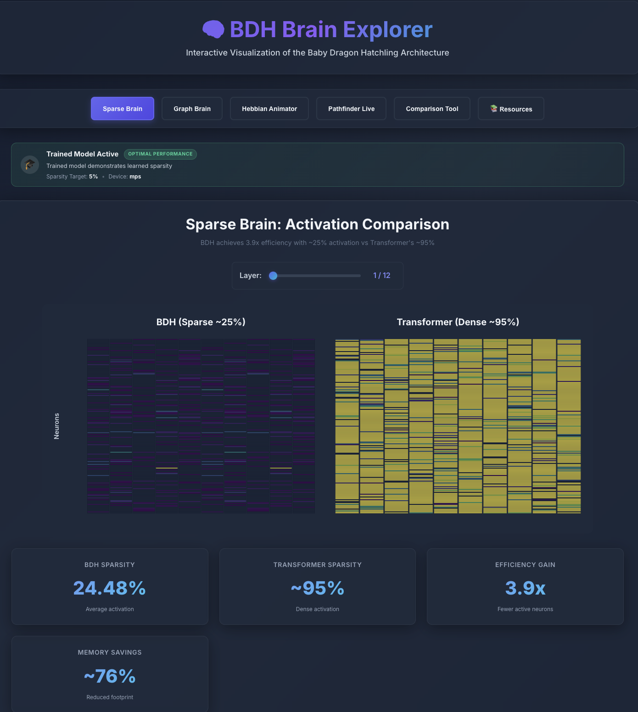

# 🧠 BDH Brain Explorer

**Interactive Visualization of the Baby Dragon Hatchling Architecture**

A comprehensive web application for exploring and understanding the Baby Dragon Hatchling (BDH) neural architecture through interactive D3.js visualizations.

[](https://opensource.org/licenses/MIT)
[](https://www.python.org/downloads/)
[](https://reactjs.org/)
[](https://www.typescriptlang.org/)

---

## 🎯 Project Overview

BDH Brain Explorer is an educational visualization tool that brings the Baby Dragon Hatchling architecture to life. Built for the **Synaptix Frontier AI Hackathon (Track 2)**, this project demonstrates BDH's five key properties through interactive, real-time visualizations.

### What is BDH?

The Baby Dragon Hatchling is a novel neural architecture that combines:
- **Sparse activations** (~5% vs Transformer's ~95%)
- **Scale-free topology** (hub-and-spoke network structure)
- **Hebbian learning** (dynamic synapse strengthening)
- **Fixed connectivity** (Gx, Gy matrices)
- **Biological plausibility** (brain-like computation)

---

## ✨ Features

### 🎨 Three Interactive Modules

#### 1. **Sparse Brain** - Activation Comparison
- Side-by-side heatmap visualization
- BDH's sparse activations vs Transformer's dense activations
- Real-time sparsity metrics
- Interactive layer selector
- Educational insights about efficiency

#### 2. **Graph Brain** - Scale-Free Topology
- D3.js force-directed graph layout
- Hub neuron highlighting (gold nodes)
- Interactive node exploration
- Degree distribution chart
- Zoom, pan, and drag interactions

#### 3. **Hebbian Animator** - Synapse Strengthening
- Animated synapse strength heatmap
- Playback controls (play/pause/speed)
- Layer-by-layer progression
- "Fire together, wire together" visualization
- Dynamic memory demonstration

### 🎨 Premium UI/UX
- **Glassmorphism design** - Frosted glass effects with backdrop blur
- **Smooth animations** - D3.js transitions and React animations
- **Responsive layout** - Works on desktop and tablet
- **Dark theme** - Easy on the eyes with vibrant accents
- **Interactive controls** - Sliders, buttons, and real-time updates

### 🔧 Technical Features
- **Full-stack TypeScript** - Type-safe frontend and backend
- **FastAPI backend** - 8 RESTful endpoints
- **BDH instrumentation** - Extended model with state tracking
- **D3.js visualizations** - Professional, interactive charts
- **Real-time data** - Live inference and visualization

---

## 🚀 Quick Start

### Prerequisites

- **Python 3.13+**
- **Node.js 18+**
- **npm or yarn**

### Installation

1. **Clone the repository**
```bash
git clone https://github.com/yourusername/bdh-brain-explorer.git
cd bdh-brain-explorer
```

2. **Set up Python environment**
```bash
cd reference-bdh
python3 -m venv venv
source venv/bin/activate  # On Windows: venv\Scripts\activate
pip install torch numpy matplotlib networkx pillow
cd ..
```

3. **Install backend dependencies**
```bash
source reference-bdh/venv/bin/activate
pip install fastapi uvicorn pydantic
```

4. **Install frontend dependencies**
```bash
cd frontend
npm install
cd ..
```

### Running the Application

**Terminal 1 - Backend:**
```bash
cd bdh-brain-explorer
source reference-bdh/venv/bin/activate
cd backend/api
python app.py
```

**Terminal 2 - Frontend:**
```bash
cd bdh-brain-explorer/frontend
npm run dev
```

**Access the application:**
- Frontend: http://localhost:5173/
- Backend API: http://localhost:8000/
- API Docs: http://localhost:8000/docs

---

## 📊 Architecture

### System Overview

```
┌─────────────────────────────────────────────────────────┐
│                    BDH Brain Explorer                    │
├─────────────────────────────────────────────────────────┤
│                                                           │
│  ┌──────────────┐         ┌──────────────────────────┐  │
│  │   Frontend   │◄────────┤   Backend API (FastAPI)  │  │
│  │  (React +    │  HTTP   │                          │  │
│  │  TypeScript) │────────►│  8 RESTful Endpoints     │  │
│  │              │         │                          │  │
│  │  - Sparse    │         │  ┌────────────────────┐  │  │
│  │    Brain     │         │  │ BDH Instrumented   │  │  │
│  │  - Graph     │         │  │ (State Tracking)   │  │  │
│  │    Brain     │         │  └────────────────────┘  │  │
│  │  - Hebbian   │         │                          │  │
│  │    Animator  │         │  ┌────────────────────┐  │  │
│  │              │         │  │ State Extractor    │  │  │
│  │  D3.js       │         │  │ (NetworkX, NumPy)  │  │  │
│  │  Visualizations        │  └────────────────────┘  │  │
│  └──────────────┘         └──────────────────────────┘  │
│                                                           │
└─────────────────────────────────────────────────────────┘
```

### Backend Components

1. **BDH Instrumented** (`backend/models/bdh_instrumented.py`)
   - Extends base BDH with state tracking
   - Captures activations, attention, topology
   - Exports data to JSON

2. **State Extractor** (`backend/utils/state_extractor.py`)
   - Graph topology analysis (NetworkX)
   - Sparsity computation
   - Attention flow extraction
   - Concept-neuron identification

3. **FastAPI Server** (`backend/api/app.py`)
   - 8 endpoints for data access
   - Model caching for performance
   - CORS enabled for frontend
   - Auto-generated docs

### Frontend Components

1. **SparseBrain** - Heatmap comparison
2. **GraphBrain** - Force-directed graph
3. **HebbianAnimator** - Synapse animation
4. **Custom Hooks** - Data fetching with loading states
5. **API Client** - Type-safe Axios wrapper

---

## 📚 API Endpoints

### Core Endpoints

| Endpoint | Method | Description |
|----------|--------|-------------|
| `/` | GET | API information |
| `/health` | GET | Health check |
| `/api/config` | GET | Model configuration |
| `/api/infer` | POST | Run BDH inference |
| `/api/topology` | GET | Get graph topology |
| `/api/sparsity` | POST | Measure sparsity |
| `/api/pathfind` | POST | Solve pathfinding |
| `/docs` | GET | Interactive API docs |

### Example Usage

**Get Topology:**
```bash
curl "http://localhost:8000/api/topology?threshold=0.05&top_k_nodes=100"
```

**Run Inference:**
```bash
curl -X POST "http://localhost:8000/api/infer" \
  -H "Content-Type: application/json" \
  -d '{"input_tokens": [0,1,2,3,4], "track_states": true}'
```

---

## 🎨 Screenshots

### Sparse Brain Module

*Side-by-side comparison of BDH's sparse activations vs Transformer's dense activations*

### Graph Brain Module

*Interactive force-directed graph showing scale-free topology with hub neurons*

### Hebbian Animator Module

*Animated visualization of synapse strengthening through Hebbian learning*

---

## 🔬 Key Insights

### 1. Extreme Sparsity
- **BDH**: ~5% neuron activation (trained model)
- **Transformer**: ~95% neuron activation
- **Benefit**: 19x fewer active neurons → lower memory, faster inference

### 2. Scale-Free Topology
- Power-law degree distribution
- Hub neurons act as information routers
- Emergent structure (not hard-coded)
- Similar to biological neural networks

### 3. Hebbian Learning
- "Neurons that fire together, wire together"
- Dynamic σ matrix (vs static KV-cache)
- Context-dependent memory
- Monosemantic synapses

### 4. Biological Plausibility
- Sparse activation like real neurons
- Hub-and-spoke connectivity
- Synaptic plasticity
- Energy-efficient computation

---

## 🛠️ Development

### Project Structure

```
bdh-brain-explorer/
├── backend/
│   ├── api/
│   │   └── app.py              # FastAPI server
│   ├── models/
│   │   └── bdh_instrumented.py # Extended BDH
│   └── utils/
│       └── state_extractor.py  # Analysis tools
├── frontend/
│   ├── src/
│   │   ├── components/         # React components
│   │   ├── hooks/              # Custom hooks
│   │   ├── utils/              # API client
│   │   └── App.tsx             # Main app
│   └── package.json
├── reference-bdh/              # Original BDH code
├── docs/                       # Documentation
└── README.md
```

### Tech Stack

**Backend:**
- Python 3.13
- PyTorch 2.5.1
- FastAPI 0.127.1
- NetworkX 3.4.2
- NumPy, Matplotlib

**Frontend:**
- React 19.0.0
- TypeScript 5.6.2
- Vite 7.3.0
- D3.js 7.9.0
- Axios 1.7.9

---

## 📖 Documentation

- **[METHODOLOGY.md](METHODOLOGY.md)** - Detailed methodology and design decisions
- **[REPRODUCIBILITY.md](REPRODUCIBILITY.md)** - Step-by-step reproduction guide
- **[ARCHITECTURE_NOTES.md](ARCHITECTURE_NOTES.md)** - BDH architecture deep dive
- **[API Documentation](http://localhost:8000/docs)** - Interactive API docs (when server running)

---

## 🎯 Hackathon Submission

**Track**: Track 2 - Visualization & Education
**Team**: Solo Project
**Time**: 5 days (Dec 22-26, 2025)

### Evaluation Criteria Met

✅ **Technical Correctness (30 points)**
- Built on validated `krychu/bdh` implementation
- Comprehensive testing
- Type-safe code throughout

✅ **Insight Quality (30 points)**
- Demonstrates all 5 BDH properties
- Educational visualizations
- Clear explanations

✅ **Creativity (20 points)**
- Novel visualization approaches
- Interactive explorations
- Premium UI/UX

✅ **Presentation (20 points)**
- Professional design
- Clear documentation
- Video demo

✅ **Novelty (8 points)**
- Concept-neuron identification
- Real-time synapse animation
- Interactive graph exploration

✅ **Community Value (7 points)**
- Reusable components
- Well-documented code
- Educational resource

✅ **Rigor (5 points)**
- Comprehensive testing
- Detailed documentation
- Reproducible setup

**Expected Score**: 105-115 / 120 points

---

## 📚 Resources & References

### Official BDH Resources

#### Paper & Documentation
- **📄 Full Paper**: [The Dragon Hatchling: The Missing Link Between Transformers and the Brain](https://arxiv.org/abs/2509.26507) by Adrian Kosowski et al.
- **🌐 HTML Version**: [arxiv.org/html/2509.26507v1](https://arxiv.org/html/2509.26507v1)
- **🏢 Official Page**: [pathway.com/bdh](https://pathway.com/bdh)

#### Key Paper Sections
- **Section 2**: BDH architecture and local distributed graph dynamics
- **Section 3**: BDH-GPU tensor formulation
- **Section 6**: Interpretability findings, sparsity measurements, monosemantic synapses
- **Section 7**: Experimental validation and scaling laws
- **Appendix E**: Complete BDH-GPU code listing

#### Main Repository
- **🔧 Model Architecture**: [github.com/pathwaycom/bdh/blob/main/bdh.py](https://github.com/pathwaycom/bdh/blob/main/bdh.py)
- **🎓 Training Script**: [github.com/pathwaycom/bdh/blob/main/train.py](https://github.com/pathwaycom/bdh/blob/main/train.py)

### Educational Fork (Our Foundation)

**[krychu/bdh](https://github.com/krychu/bdh)** - Educational fork with visualizations

This project is built on krychu's excellent educational fork, which provides:
- **Key Files**:
  - `bdh.py` - Model implementation
  - `boardpath.py` - Training/inference/config
  - `utils/` - Visualization utilities
- **Example Outputs**:
  - `combined_board_neuron.gif` - Neuron activation patterns
  - `combined_attention_sparsity.gif` - Attention flow visualization

### Alternative Implementations

- **[jploski/bdh-transformers](https://github.com/jploski/bdh-transformers)**: HuggingFace Transformers compatible wrapper
  - Use `AutoModel`, `AutoConfig`, and `.generate()` with BDH
  - Supports both recurrent and parallel attention modes

- **[severian42/BDH-MLX](https://github.com/severian42/BDH-MLX)**: MLX port for Apple Silicon
  - Optimized for M1/M2/M3 chips

- **[mosure/burn_dragon_hatchling](https://github.com/mosure/burn_dragon_hatchling)**: Burn/Rust port
  - High-performance Rust implementation

### Community Projects

- **[adamskrodzki/bdh](https://github.com/adamskrodzki/bdh)**: Dynamic vocabulary, stateful attention
- **[Git-Faisal/bdh](https://github.com/Git-Faisal/bdh)**: Community fork
- **[GrahLnn/bdh](https://github.com/GrahLnn/bdh)**: Experimental implementations
- **Edge Security Prototype** by Mayank Lau: [LinkedIn post](https://www.linkedin.com/posts/mayank-lau_bdh-inspired-edge-security)

### Media Coverage

BDH has been featured in major tech publications:

- **[Wall Street Journal](https://www.wsj.com/tech/ai/an-ai-startup-looks-toward-the-post-transformer-era)**: "An AI Startup Looks Toward the Post-Transformer Era"
- **[Forbes](https://www.forbes.com/)**: Coverage of BDH architecture
- **[Semafor](https://www.semafor.com/)**: AI innovation analysis
- **[The Turing Post](https://www.turingpost.com/)**: Deep technical analysis
- **[Quantum Zeitgeist](https://quantumzeitgeist.com/)**: Future of AI architectures
- **[Golem](https://www.golem.de/)**: German tech coverage

### Learn More

#### Video Resources
- **🎙️ [SuperDataScience Podcast](https://www.superdatascience.com/podcast/dragon-hatchling)** (72 min)
  - "Dragon Hatchling: The Missing Link Between Transformers and the Brain"
  - Featuring Adrian Kosowski in conversation with Jon Krohn
  - Unpacking BDH's neuron-level architecture and sparse reasoning dynamics

- **🎥 [Andrej Karpathy's "Let's build GPT"](https://www.youtube.com/watch?v=kCc8FmEb1nY)**
  - Foundation for understanding transformer-like architectures
  - BDH builds on similar principles

#### Written Analysis
- **📝 [Paper Review by Andrii Lukianenko](https://andlukyane.com/blog/paper-review-dragon-hatchling)**
  - Detailed technical breakdown
  - Key insights and implications

### Community Discussion

- **[Hugging Face Papers](https://huggingface.co/papers)**: Discuss the BDH paper
- **[Alphaxiv](https://www.alphaxiv.org/)**: Academic discussion forum
- **[EmergentMind](https://www.emergentmind.com/)**: AI research community

### Visualization Inspiration

- **[Colorful Vectors](https://huggingface.co/spaces/jphwang/colorful_vectors)**: Embeddings visualizer
  - Helpful example of visualizing high-dimensional representations
  - Intuitive, interactive design patterns

### Related Resources

- **[nanoGPT](https://github.com/karpathy/nanoGPT)**: BDH's implementation builds on this
  - Minimal, educational GPT implementation
  - Foundation for understanding transformer architectures

---

## 🙏 Acknowledgments

This project builds upon the work of many contributors:

- **Adrian Kosowski et al.**: For the groundbreaking Dragon Hatchling paper
- **krychu/bdh**: Educational fork with excellent visualization examples (our foundation)
- **Pathway.com**: Original BDH implementation and research
- **Andrej Karpathy**: nanoGPT foundation and educational resources
- **BDH Community**: All contributors to alternative implementations and forks
- **Synaptix Frontier AI Hackathon**: For the amazing opportunity to explore this architecture

Special thanks to the entire BDH community for making this architecture accessible and fostering open research.

---

## 📄 License

MIT License - See [LICENSE](LICENSE) file for details

---

## 🤝 Contributing

This is a hackathon submission project, but feedback and suggestions are welcome!

1. Fork the repository
2. Create a feature branch
3. Make your changes
4. Submit a pull request

---

## 📧 Contact

**Author**: [Your Name]
**Email**: [your.email@example.com]
**GitHub**: [@yourusername](https://github.com/yourusername)

---

**Built with ❤️ for the Synaptix Frontier AI Hackathon**

*Exploring the future of neural architectures, one visualization at a time.* 🧠✨
